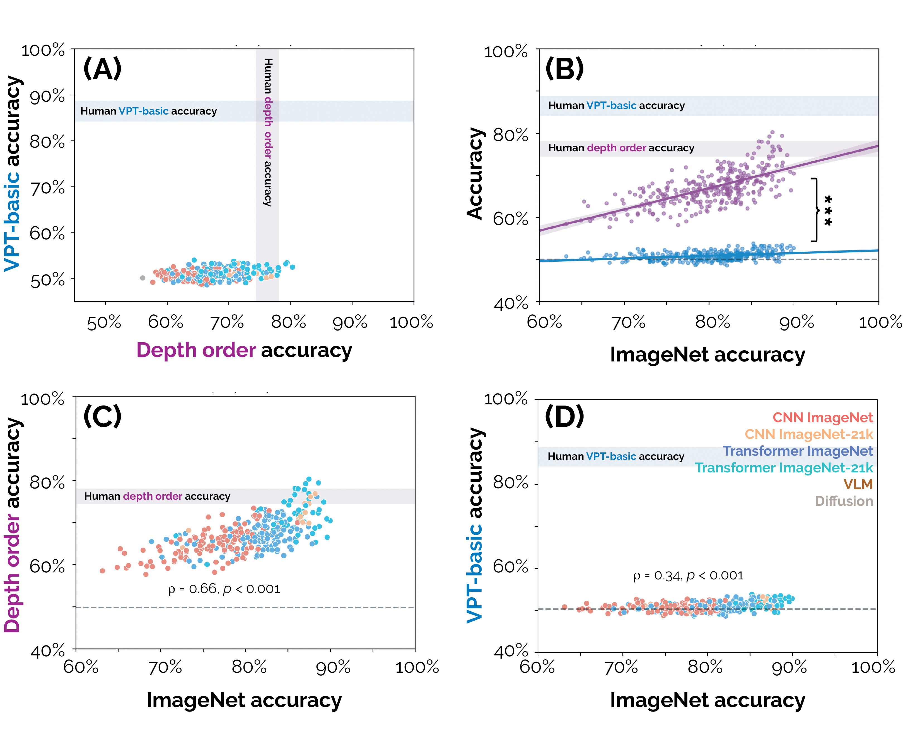
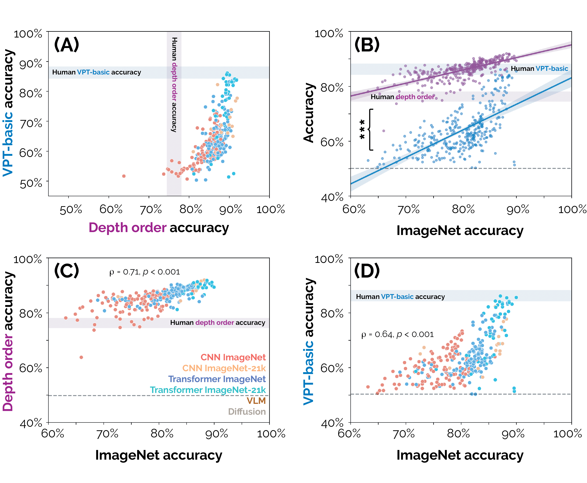

## Model Evaluation and Results
We evaluated 327 different DNNs on 3D-PC by both linear probing and fine-tuning models on VPT-basic and depth order tasks.
 <hr>

### Linear Probe Results
<figure>
    
</figure>
<b>DNN performance on the depth order and VPT-basic tasks in the 3D-PC after linear probing or prompting.</b> <b>(A, B)</b> DNNs are significantly more accurate at depth order than VPT-basic. Human confidence intervals are S.E.M. and ***: p < 0.001. <b>(C, D)</b> DNN accuracy for depth order and VPT-basic strongly correlates with object classification accuracy on ImageNet. Dashed lines are the mean of label-permuted human noise floors.

### Fine-tune Results

<figure>
    
</figure>
<b>DNN performance on the depth order and VPT-basic tasks in the 3D-PC after fine-
tuning.</b> <b>(A)</b> Fine-tuning makes DNNs far better than humans at the depth order task and improves
the performance of several DNNs to be at or beyond human accuracy on VPT-basic. <b>(B)</b> Even after
fine-tuning, there is still a significant difference in model performance on depth order and VPT-basic
tasks, p < 0.001 . <b>(C, D)</b> DNN accuracy on both tasks after fine-tuning correlates with ImageNet
object classification accuracy. Human confidence intervals are S.E.M. and ***: p < 0.001. Dashed
lines are the mean of label-permuted human noise floors.

<hr>

### TIMM Evaluation
To linear probe a timm model
```
python run_linear_probe.py --task <task> --data_dir <data_folder>/<task>/ --model_name <model_name>
```

To fine-tune a timm model
```
python run_finetune.py --task <task> --data_dir <data_folder>/<task>/ --model_name <model_name>
```

`data_folder`: Root directory for the dataset

`task`: Either `perspective` or `depth`

`model_name`: TIMM model name
